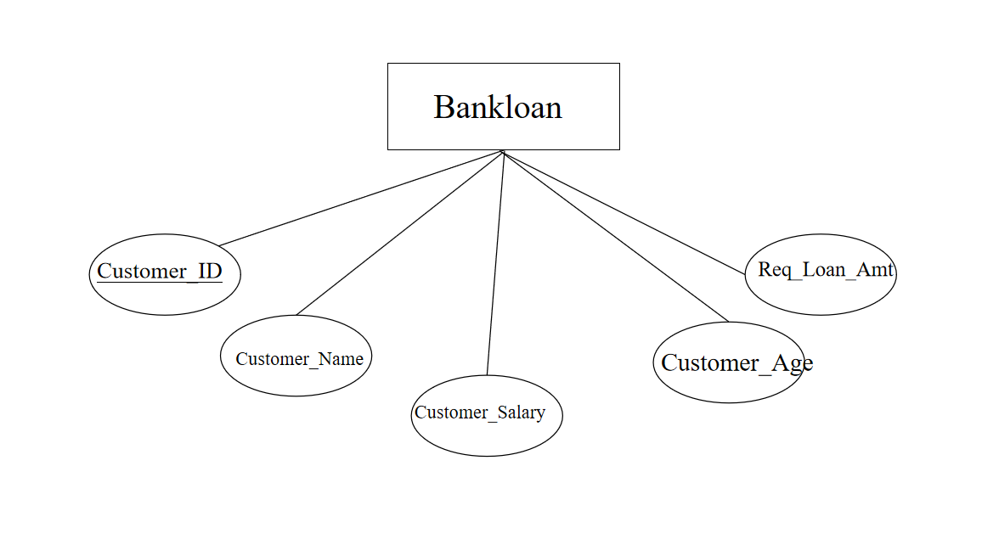

# Ex02 Django ORM Web Application
## DATE
12.11.2024

## AIM
To develop a Django application to store and retrieve data from a bank loan database using Object Relational Mapping(ORM).

## ENTITY RELATIONSHIP DIAGRAM


## DESIGN STEPS

### STEP 1:
Clone the problem from GitHub

### STEP 2:
Create a new app in Django project

### STEP 3:
Enter the code for admin.py and models.py

### STEP 4:
Execute Django admin and create details for 10 books

## PROGRAM
```
admin.py

from django.contrib import admin
from .models import Bankloan,LoanAdmin
admin.site.register(Bankloan,LoanAdmin)


models.py

from django.db import models
from django.contrib import admin
class Bankloan (models.Model):
    Customer_ID=models.IntegerField(primary_key=True)
    Customer_Name=models.CharField(max_length=100)
    Customer_Salary=models.IntegerField()
    Customer_Age=models.IntegerField()
    Req_Loan_Amt=models.IntegerField()
 
class LoanAdmin(admin.ModelAdmin):
    list_display=('Customer_ID','Customer_Name','Customer_Salary','Customer_Age','Req_Loan_Amt')

```


## OUTPUT


## RESULT
Thus the program for creating a database using ORM hass been executed successfully
